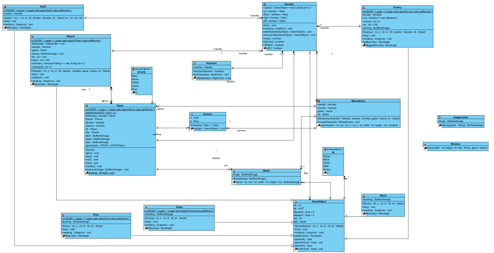
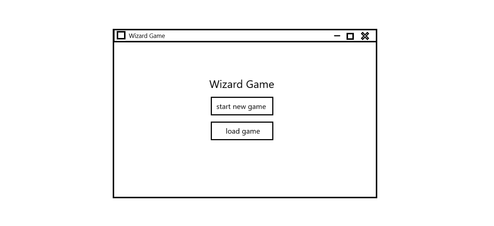
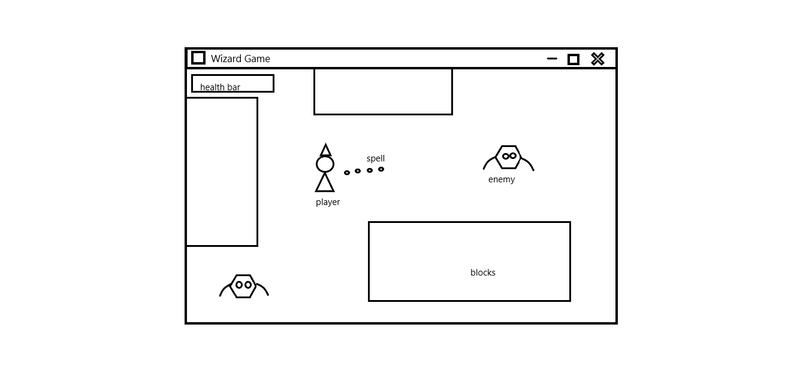

# Wizard RPG

## Téma projektu
Pro svou semestrální práci jsem si zvolila téma herní engine. Přesněji se hráč ocitá v roli kouzelníka, jenž má za úkol dokončit úroveň získáním klíče k úniku z bojové místnosti.   

## Cíle projektu
Cílem je vytvoření základních prvků, kterými disponuje jádro RPG hry, a seznámit se tak s procesy za návrhem jednoduché hry a jejími funkčnostmi poskytovaných v Java. 

## Manuál
Po spuštění hry máte možnost začít novou nebo načíst již existující uloženou hru. Pro spuštění nové hry zvolte 'new game', naopak pro načtení rozehrané kampaně vyberte 'load game'. Následně se ocitnete v samotné hře, kde máte v rukou veškerou kontrolu nad postavou kouzelníka. Pomocí pohybu na klávesách WASD se můžete se svou postavou pohybovat po mapě levelu. Sesíláním kouzel uskutečněné pravým tlačítkem myši usmrtíte nepřátelská monstra. Po levé straně se zobrazuje zelený bar, který představuje množství životů vašeho kouzelníka. Je třeba si své životy hlídat, jelikož po každém střetnutí vaší postavy s monsterem ztrácíte část těchto životů. Zároveň máte omezený počet střel svých kouzel, nicméně můžete si je doplnit skrze získaní truhly. Sebrání truhly je uskutečněno postavením se na obrázek truhly. Pod barem se životy je uvedený počet zbývajících střel, tzv. mana, včetně i obsahu inventáře. V záhlaví máte k dispozici tlačítko pro uložení aktuální hry, jež můžete použít hned několikrát. Pro úspěšné dokončení hry není nezbytné usmrtit veškerá pobíhající monstra pomocí zmíněného seslání kouzla. Nicméně pro splnění levelu máte za úkol získat klíče k otevření dveří, jimiž dostanete svého kouzelníka do bezpečí. 
 
## Dokumentace 
**Class diagram (EA):**

## Wireframes

 

